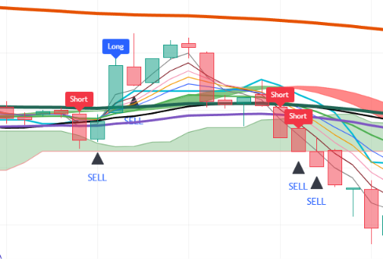

# Pine-Script-1-3-9-Multi-Timeframe-Indicator
Indicator based on synchronized 1-minute, 3-minute, and 9-minute EMA ribbons, multi-timeframe RSI momentum, Ichimoku Kinko Hyo, Hull Suite, and higher-timeframe benchmark levels with a modular "Use" toggle architecture. Signals entry for long/short across 1m, 3m, and 9m chart resolutions on TradingView.
--
## Chart Preview

--
## Motivation & Problem
- **Noise vs. Lag Across Varying Time Horizons**: Scalpers and intraday traders struggle between hyper-sensitive 1-minute noise and lagging higher-timeframe signals, leading to premature entries or missing swift momentum expansions.
- **The Core Goal**: To develop a unified multi-timeframe indicator specifically optimized for 1m, 3m, and 9m charts—standardizing fast EMA ribbon crossovers against key baseline filters (EMA/SMA 30), aligning multi-timeframe RSI momentum, and anchoring price action against higher-timeframe (1H & 1D) open benchmarks.
--
## Strategy Logic & Architecture
- This indicator avoids false signals and wrong interpretation of the trend by utilizing a **rule-based, multi-factor filtering system**:
### Core Components:
1. **Synchronized EMA Ribbons Across 1m, 3m, and 9m**:
  - Computes a full 10-period EMA ribbon (lengths 3, 5, 7, 9, 12, 20, 30, 60, 100, 200) across three distinct timeframe tiers: 1-minute, 3-minute, and 9-minute charts via 'request.security()'.
  - Evaluates crossover events between fast momentum EMAs (lengths 5, 7, 9) and the intermediate baseline filter (EMA 30 on 1m/3m, SMA 30 on 9m) to trigger directional crosses ('EMCrossUp' / 'EMCrossDown').
  - Includes an integrated Hull Suite band (HMA length 55, 240m HTF) for macro smoothing and trend coloring.
2. **Multi-Timeframe RSI Confirmation & Modular "Use" Toggles**:
  - Gathers dedicated multi-timeframe RSI values (lengths 7, 9, 11) for 1m ('To23RSI'), 3m ('To3RSI'), and 9m ('To13RSI') charts.
  - Validates momentum direction above 55 (bullish expansion) or below 45 (bearish expansion).
  - Uses dynamic boolean toggles ('UseEMA1to10', 'UseRSI') combined with ternary bypass logic ('x ? y : true') to enable seamless filter customization without code edits.
3. **Adaptive Timeframe Execution Rules (1m, 3m, and 9m)**:
  - **1-Minute Chart Signals (IN1)**:
    - **Bullish Signal**: Triggers on 1m timeframe when 1m fast EMAs cross above EMA 30 (if enabled) and 1m RSI is above 55 (if enabled).
    - **Bearish Signal**: Triggers on 1m timeframe when 1m fast EMAs cross below EMA 30 (if enabled) and 1m RSI is below 45 (if enabled).
  - **3-Minute Chart Signals (IN3)**:
    - **Bullish Signal**: Triggers on 3m timeframe when 3m fast EMAs cross above EMA 30 (if enabled) and 3m RSI is above 55 (if enabled).
    - **Bearish Signal**: Triggers on 3m timeframe when 3m fast EMAs cross below EMA 30 (if enabled) and 3m RSI is below 45 (if enabled).
  - **9-Minute Chart Signals (IN9)**:
    - **Bullish Signal**: Triggers on 9m timeframe when 9m fast EMAs cross above SMA 30 (if enabled) and 9m RSI is above 55 (if enabled).
    - **Bearish Signal**: Triggers on 9m timeframe when 9m fast EMAs cross below SMA 30 (if enabled) and 9m RSI is below 45 (if enabled).
  - **Exit Plotshape**: Automatically displays a "SELL" triangular marker on the immediate bar following any long or short entry.
4. **Visual Ichimoku Cloud & Dynamic Higher-Timeframe Levels**:
  - Renders a complete Ichimoku Kinko Hyo overlay (Conversion Line 9, Base Line 26, Leading Spans 52) with shaded Kumo Cloud for macro trend context.
  - Dynamically projects real-time horizontal benchmark lines for 1-Hour ('open1H') and 1-Day ('open1D') candle opens, functioning as un-lagged session support and resistance pivots.
--
## Configurable Parameters
Users can adjust the following parameters inside TradingView's settings panel:
- **Time Frame Inputs**: Default - 1m, 2m, 3m, 9m. Configurable intervals for multi-timeframe calculations.
- **EMA Ribbon (Lengths 1-10)**: Default - 3, 5, 7, 9, 12, 20, 30 (EMA/SMA), 60, 100, 200. Toggle switches for signal crossover evaluation ('UseEMA1to10'), global ribbon visualization ('PlotEMA1to10'), and EMA 30 plotting.
- **RSI Time Frames & Lengths**: Default - 1m, 3m, and 9m timeframes with lengths 7, 9, 11. Overbought/oversold momentum thresholds (55 / 45) with 'UseRSI' toggle.
- **Ichimoku Kinko Hyo**: Default - Conversion Line 9, Base Line 26, Leading Span B 52, Displacement 26 with 'PlotIchimoku' toggle.
- **Hull Suite**: Default - HMA length 55, 240m HTF. Customizable modes (HMA, EHMA, THMA), band transparency, and line thickness.
- **Time Mark (1H & 1D Anchors)**: Customizable line colors and widths for real-time 1-hour and 1-day opening price horizontal levels.
--
## How to Install & Use in TradingView
1. Open any crypto chart (e.g., `BTC/USDT`) on **[TradingView](https://www.tradingview.com/)**.
2. Open the **`Pine Editor`** console at the bottom of the page.
3. Open `1-3-9.txt` (or your Pine Script file), copy the source code, and paste it into the editor.
4. Click **`Save`** and then click **`Add to Chart`**.
5. Switch chart timeframes to **`1m`**, **`3m`**, or **`9m`** and click the gear icon (`Settings`) on the indicator to adjust parameters as needed.
--
## Key Learnings & Engineering Reflections
1. **Multi-Resolution Architecture in a Single Script**
  - I learned that computing independent EMA and RSI matrix arrays across 1m, 3m, and 9m resolutions allows a single script to act as a scalable multi-resolution system. By checking 'timeframe.period == "1"', '"3"', or '"9"', the indicator deploys the exact tuned parameters matching each chart pace.
2. **Differentiated Baseline Cross Filtering (EMA 30 vs. SMA 30)**
  - I learned that testing fast EMAs (lengths 5, 7, 9) against EMA 30 on faster timeframes (1m/3m) captures swift breakout velocity, while testing against SMA 30 on the 9m timeframe smooths out higher-period volatility and prevents false whipsaws.
3. **Modular Filter Control Using the Ternary Operator (x ? y : true)**
  - I learned that using the ternary operator (x ? y : true) allows effortless toggling of individual conditions. If x (Use toggle) is true, the script evaluates y (the filter condition); if x is false, it returns true as a pass-through bypass. This preserves compound boolean logic while giving traders full control over which sub-filters remain active.
